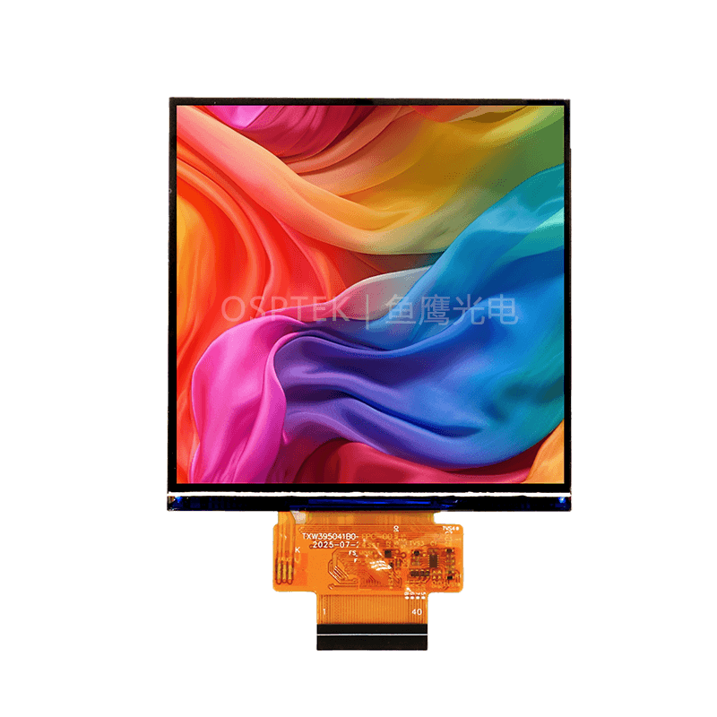

<p align="left"></p>

<h1 align="center">OSPTEK 3.95″ TFT 480×480（ST7102 · RGB）</h1>

<p align="center"><b>方形 TFT 模组 · RGB · ST7102 · In-Cell 触摸</b></p>

<p align="center"><a href="./README_EN.md">English</a> | 简体中文 · <a href="../../README.md">规格族索引</a></p>

<p align="center">
  
  
  
  
</p>

<p align="center"></p>

## 目录

- [产品简介](#产品简介)
- [规格参数](#规格参数)
- [仓库结构](#仓库结构)
- [相关资料](#相关资料)
- [购买链接](#购买链接)
- [技术支持](#技术支持)

---

## 产品简介

OSPTEK **3.95 寸 480×480 TFT** 是一款 **RGB 18-bit** 接口彩色显示模组，显示驱动为 **ST7102**，模组为 **In-Cell** 电容触摸（FPC 引出 `TP_SDA` / `TP_SCL`）。适合方形 HMI、仪表与中尺寸交互面板等场景。

规格标识（仓库名）：`3.95-tft-480x480-rgb-st7102`

当前模组版本：**YDP395B005-V4**。电气与外形细节以 [`docs/YDP395B005-V4.pdf`](./docs/YDP395B005-V4.pdf) 为准。

## 规格参数

| 项目 | 规格 |
| ---- | ---- |
| 尺寸 | 3.95 英寸 |
| 类型 | TFT / IPS（彩色 · In-Cell） |
| 分辨率 | 480×480 |
| 接口 | RGB 18-bit |
| 驱动 IC | ST7102 |
| 触摸 | In-Cell（电容；FPC 含 TP I²C） |

> 完整外形尺寸、FPC 定义、供电与时序以产品规格书 / 驱动手册为准。

## 仓库结构

```text
3.95-tft-480x480-rgb-st7102/                                # 仓库根（导航见 ../../README.md）
└── versions/
    └── YDP395B005-V4/                                # 本料号完整资料
        ├── README.md
        ├── README_EN.md
        ├── images/
        └── docs/
```

## 相关资料

### 本产品资料

| 资料 | 链接 |
| ---- | ---- |
| 产品规格书（YDP395B005-V4） | [`docs/YDP395B005-V4.pdf`](./docs/YDP395B005-V4.pdf) |
| 驱动 IC 数据手册（ST7102） | [`docs/ST7102_Datasheet_V0.22.pdf`](./docs/ST7102_Datasheet_V0.22.pdf) |
| 初始化序列（文本） | [`docs/CODE.txt`](./docs/CODE.txt) |

## 购买链接

<p align="center">
  <a href="https://shop110742373.taobao.com/"></a>
  &nbsp;&nbsp;
  <a href="https://www.aliexpress.com/store/1105701619"></a>
</p>

**国内（淘宝）**

- 店铺：[鱼鹰光电工厂店](https://shop110742373.taobao.com/)

**海外（AliExpress）**

- 店铺：[OSPTEK Official Store](https://www.aliexpress.com/store/1105701619)

## 技术支持

- 技术支持 / 产品咨询：<luyu@osptek.com>
- QQ 技术交流群：**985881096**
- 公司官网：<https://osptek.com/>
- 有任何问题，都可以在本仓库 Issues 中提问

---

<p align="center"><sub>© 2026 OSPTEK 鱼鹰光电 · 本仓库资料采用 CC BY 4.0 许可</sub></p>
